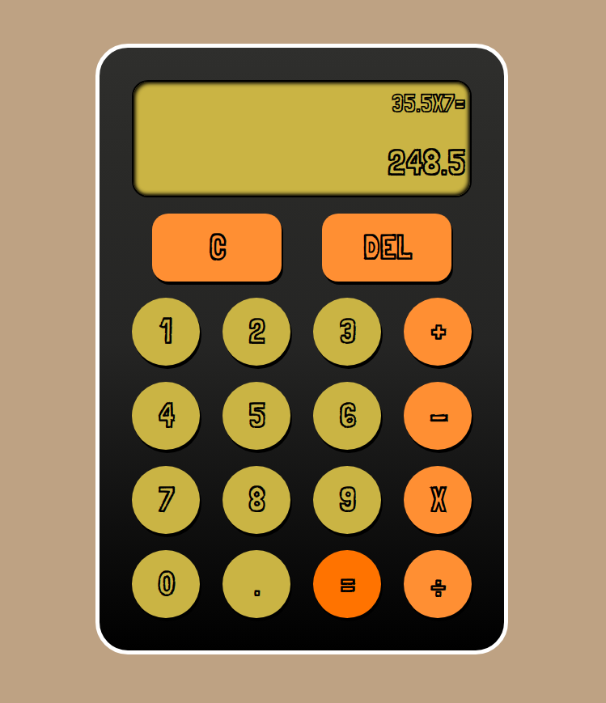

# Calculator

A basic arithmetic calculator developed into the web using basic HTML, CSS and JavaScript.

**Check it out :point_right:[here](https://mell62.github.io/calculator):point_left:!**

## What can it do?

- Basic arithmetic: Addition, Subtraction, Multiplication, Division
- Negative number arithmetic
- Decimal arithmetic
- Deletion and clearing

## What can it **not** do? (Possible future additions)

- Operations with operand numbers larger than 8 digits
- Operation result greater than 10 digits
- Exponents
- Brackets
- High-tier mathematical operations like calculus
- History log of calculations
- Division by zero :wink:

## :electric_plug: Extra features

### Keyboard support

- Numbers: 1-9
- Decimal: .
- Operations:
  - Addition: +
  - Subtraction: -
  - Multiplication: \*, x, X
  - Division: /
- Equals: =, Enter
- Delete: Backspace, Delete
- Clear: c, C
